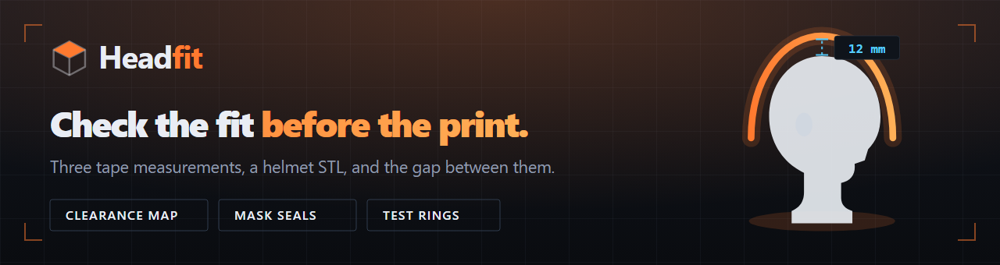
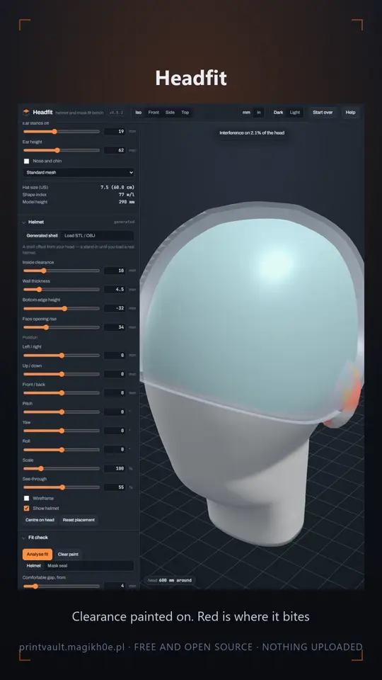

# Headfit



A helmet and mask fit bench that runs in your browser.

Printing a helmet is hours of work and often days of it, and you usually find
out it doesn't fit after all of that. Headfit builds a model of your head from
three tape measurements, takes the STL you were about to print, and shows you
where the two collide before you commit the filament.

**Live at <https://printvault.magikh0e.pl/headfit.html>** — nothing to install,
no account, and nothing you load ever leaves your browser.

### Watch it

<a href="https://youtu.be/B8cpOXRhWRE"></a>

Half a minute of it, from the second half of a reel that starts with
[PrintVault](https://github.com/magikh0e/PrintVault): a head built from tape
measurements, a helmet put where you would wear it, and the clearance painted
on, red where it bites. It plays on [YouTube](https://youtu.be/B8cpOXRhWRE) or on
[the site](https://printvault.magikh0e.pl/#reel). GitHub will not play a video
stored in a repo, which is why this is a poster rather than a player.

## What it does

- **Clearance, painted on.** Load a helmet or a mask and the head is coloured by
  how much room there is, from touching to comfortable, so a tight temple is
  something you see rather than something you deduce.
- **A section cut through the tightest point.** The colours tell you where the
  problem is; the cut tells you by how many millimetres.
- **Mask seal mode.** For a mask a gap is the failure and a gentle press is the
  goal, which is the opposite of what a helmet wants, so it scores differently.
  It can take the seal line from the mask's own open edge and sweep a gasket
  along it, which is a thing you can print.
- **Printable sizing rings.** A tape measure held by yourself in a mirror is how
  most people get their head size wrong, usually by pulling it tight. Print a
  ring, try it on, read the number off it.
- **Share a head as a link.** The measurements ride in the fragment, which a
  browser never sends to a server, because they are measurements of your body.

## Why the head is not round

Heads are ovals, flatter across the forehead than around the back. A circular
model lies to you: it binds at the temples while leaving a gap front to back,
and you come away with a size that is too large.

Headfit builds its head from a superellipse cross section whose exponent changes
with height, so the cranium stays rounded and the jaw goes flat across the front
with a corner at the back, which no amount of scaling one ellipse will give you.
The ring at the brow is held to exactly the perimeter you measured, and
everything above and below is shaped around it.

It is still a model built from three numbers, not a scan of you. It is good
enough to tell you a helmet is 4 mm too tight at the temples. It is not good
enough to design a respirator seal for someone's face and skip the fit test.

## Running it yourself

It is one HTML file. Open it, or serve the folder, or put it on any static host.

```sh
git clone https://github.com/magikh0e/headfit.git
cd headfit
python -m http.server 8000
```

There is no build step and no dependency to install. Three.js is inlined in the
file, which is most of its size.

## Support

Free and open source, written in my own time, with no accounts, tracking or
ads. If it has saved you a helmet's worth of filament, a beer helps.

[](https://buymeacoffee.com/magikh0e)

A helmet that fit in here and not on your head is the single most useful thing
you can report, with the three measurements you used and the model you tried.
That is the case the model is there to get right, and I only have my own head
to check it against.

Something broken goes in [Issues](https://github.com/magikh0e/headfit/issues).
Measurements that came out wrong, a mask the seal detection could not find an
edge on, or a head shape the superellipse cannot reach, go in
[Discussions](https://github.com/magikh0e/headfit/discussions).

## Where it came from

Headfit was written inside [PrintVault](https://github.com/magikh0e/PrintVault),
a local-first manager for a folder full of print files, and it is still served
from that project's site. It moved out on 2026-09-25 because it is a separate
tool on its own version number, and being a file in someone else's repo meant it
had no page, no releases and no issues of its own.

Nothing here depends on PrintVault, and nothing there depends on this. If you
use both, Settings in PrintVault has a button that opens this.

## Licence

GPL-3.0-or-later. Use it, change it, host it, include it with anything, as long
as what you pass on stays free too.
